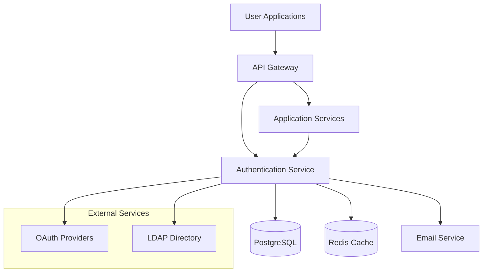

# Documentation Style Guidelines
## Creating Clear, Maintainable, and Accessible Documentation for SPARC Projects

### Documentation Philosophy

Documentation in SPARC methodology serves as the bridge between human understanding and AI collaboration. Every piece of documentation must serve multiple audiences:
- **Human developers** seeking to understand system design and implementation
- **AI modes** requiring structured context for effective collaboration
- **Stakeholders** needing clear explanations of features and capabilities
- **Future maintainers** who need comprehensive system knowledge
- **Auditors and compliance teams** requiring traceability and evidence

**Core Principle**: Documentation is not an afterthought—it's a living, breathing part of the system that evolves with the code and captures the reasoning behind every decision.

### Documentation Hierarchy and Structure

#### The SPARC Documentation Ecosystem

```
docs/
├── README.md                    # Project overview and quick start
├── specification.md             # Complete requirements (Specification phase)
├── pseudocode.md               # Algorithm designs (Pseudocode phase)
├── architecture.md             # System design (Architecture phase)
├── refinement.md               # Implementation notes (Refinement phase)
├── completion.md               # Deployment guide (Completion phase)
│
├── api/                        # API documentation
│   ├── README.md              # API overview
│   ├── authentication.md      # Auth flows and security
│   ├── endpoints/             # Individual endpoint docs
│   │   ├── users.md
│   │   ├── auth.md
│   │   └── profiles.md
│   └── openapi.yaml           # Machine-readable API spec
│
├── security/                   # Security documentation
│   ├── README.md              # Security overview
│   ├── threat-model.md        # Threat analysis
│   ├── security-architecture.md # Security design
│   ├── compliance.md          # Regulatory requirements
│   └── audit-reports/         # Security audit results
│
├── deployment/                 # Operations documentation
│   ├── README.md              # Deployment overview
│   ├── infrastructure.md      # Infrastructure design
│   ├── monitoring.md          # Observability setup
│   ├── disaster-recovery.md   # DR procedures
│   └── runbooks/              # Operational procedures
│
├── user-guides/               # End-user documentation
│   ├── getting-started.md     # User onboarding
│   ├── features/              # Feature-specific guides
│   └── troubleshooting.md     # Common issues
│
└── development/               # Developer guides
    ├── setup.md               # Local development setup
    ├── contributing.md        # Contribution guidelines
    ├── testing.md             # Testing strategies
    └── patterns.md            # Common patterns and practices
```

### Writing Standards and Style Guide

#### Tone and Voice

**Professional yet Approachable**: Write as if explaining to a competent colleague who is unfamiliar with this specific system.

```markdown
<!-- GOOD: Clear, direct, helpful -->
## User Authentication Flow

The authentication system uses JWT tokens with refresh token rotation to provide secure, scalable user sessions. When a user logs in, they receive:

1. **Access Token** (15-minute expiry): Used for API requests
2. **Refresh Token** (7-day expiry): Used to obtain new access tokens

This approach balances security (short-lived access tokens) with user experience (automatic token refresh).

<!-- AVOID: Overly casual or overly technical -->
## Auth Stuff

So basically we're using JWTs because they're pretty cool and everyone uses them now. The tokens expire and stuff so it's secure I guess.

## JWT-Based Authentication Implementation

The system implements RFC 7519-compliant JSON Web Tokens utilizing RS256 asymmetric cryptographic signatures with 2048-bit RSA key pairs, implementing temporal validity constraints via standard 'exp' and 'iat' claims, synchronized with NTP-derived timestamp validation.
```

#### Structure and Organization

**Inverted Pyramid Structure**: Most important information first, details later.

```markdown
## User Profile Management

Users can create, view, edit, and delete their profile information including personal details, preferences, and privacy settings.

### Quick Actions
- **View Profile**: Navigate to Settings → Profile
- **Edit Profile**: Click "Edit" button on profile page
- **Privacy Settings**: Use "Privacy" tab in profile editor

### Detailed Features

#### Personal Information
Users can update their display name, email address, and profile picture...

#### Privacy Controls
The system provides granular privacy controls allowing users to...

#### Data Export
Users can download their complete profile data in JSON format...
```

#### Headings and Navigation

**Consistent Heading Hierarchy**:
```markdown
# Document Title (H1) - Only one per document
## Major Sections (H2) - Primary content divisions
### Subsections (H3) - Detailed breakdowns
#### Specific Topics (H4) - Fine-grained details
##### Implementation Notes (H5) - Technical specifics
###### Code Examples (H6) - Rare, for complex nested content
```

**Navigation-Friendly Headings**:
```markdown
<!-- GOOD: Scannable, descriptive -->
## API Authentication Methods
### OAuth 2.0 Integration
### JWT Token Management
### API Key Configuration

<!-- AVOID: Generic or unclear -->
## Authentication
### Method 1
### Method 2
### Configuration
```

### Code Documentation Standards

#### Inline Code Documentation

**Function Documentation Template**:
```javascript
/**
 * Validates and sanitizes user input for profile updates
 * 
 * This function applies SPARC security principles by validating all input
 * against defined schemas and sanitizing data to prevent XSS attacks.
 * 
 * @param {Object} userInput - Raw user input from API request
 * @param {string} userInput.displayName - User's display name (3-50 characters)
 * @param {string} userInput.email - Email address (valid email format)
 * @param {string} [userInput.bio] - Optional bio text (max 500 characters)
 * 
 * @returns {Promise<Object>} Validated and sanitized user data
 * @throws {ValidationError} When input fails validation rules
 * @throws {SecurityError} When input contains potentially malicious content
 * 
 * @example
 * const cleanInput = await validateUserInput({
 *   displayName: "John Doe",
 *   email: "john@example.com",
 *   bio: "Software developer from Seattle"
 * });
 * 
 * @since 1.2.0
 * @see {@link docs/security/input-validation.md} for validation rules
 */
async function validateUserInput(userInput) {
  // Implementation details...
}
```

**Class Documentation Template**:
```javascript
/**
 * User Authentication Service
 * 
 * Handles all user authentication operations including login, logout,
 * token management, and session validation. Implements SPARC security
 * principles with comprehensive audit logging.
 * 
 * @class UserAuthService
 * @implements {AuthenticationInterface}
 * 
 * @example
 * const authService = new UserAuthService({
 *   database: dbConnection,
 *   logger: appLogger,
 *   tokenSecret: process.env.JWT_SECRET
 * });
 * 
 * const session = await authService.authenticate({
 *   email: 'user@example.com',
 *   password: 'securePassword123'
 * });
 */
class UserAuthService {
  /**
   * Initialize authentication service with required dependencies
   * 
   * @param {Object} config - Service configuration
   * @param {Database} config.database - Database connection
   * @param {Logger} config.logger - Application logger
   * @param {string} config.tokenSecret - JWT signing secret
   */
  constructor(config) {
    // Implementation...
  }
}
```

#### API Documentation Standards

**Endpoint Documentation Template**:
```markdown
## POST /api/auth/login

Authenticate user credentials and create a new session.

### Request

**URL**: `/api/auth/login`
**Method**: `POST`
**Content-Type**: `application/json`
**Authentication**: None required

#### Request Body
```json
{
  "email": "user@example.com",
  "password": "userPassword123",
  "rememberMe": false
}
```

| Field | Type | Required | Description |
|-------|------|----------|-------------|
| `email` | string | Yes | Valid email address (max 254 chars) |
| `password` | string | Yes | User password (min 8 chars) |
| `rememberMe` | boolean | No | Extend session duration (default: false) |

### Response

#### Success Response (200 OK)
```json
{
  "success": true,
  "data": {
    "user": {
      "id": "uuid-v4",
      "email": "user@example.com",
      "displayName": "John Doe",
      "roles": ["user"]
    },
    "tokens": {
      "accessToken": "jwt-access-token",
      "refreshToken": "jwt-refresh-token",
      "expiresIn": 900
    }
  }
}
```

#### Error Responses

**400 Bad Request** - Invalid input data
```json
{
  "success": false,
  "error": {
    "code": "VALIDATION_ERROR",
    "message": "Invalid email format",
    "details": {
      "field": "email",
      "value": "invalid-email"
    }
  }
}
```

**401 Unauthorized** - Invalid credentials
```json
{
  "success": false,
  "error": {
    "code": "INVALID_CREDENTIALS",
    "message": "Email or password is incorrect"
  }
}
```

**429 Too Many Requests** - Rate limit exceeded
```json
{
  "success": false,
  "error": {
    "code": "RATE_LIMIT_EXCEEDED",
    "message": "Too many login attempts. Try again in 15 minutes.",
    "retryAfter": 900
  }
}
```

### Security Considerations

- **Rate Limiting**: 5 attempts per 15 minutes per IP address
- **Password Policy**: Minimum 8 characters, complexity requirements
- **Session Security**: JWT tokens with 15-minute expiry
- **Audit Logging**: All authentication attempts are logged

### Examples

#### cURL Example
```bash
curl -X POST https://api.example.com/auth/login \
  -H "Content-Type: application/json" \
  -d '{
    "email": "user@example.com",
    "password": "securePassword123"
  }'
```

#### JavaScript Example
```javascript
const response = await fetch('/api/auth/login', {
  method: 'POST',
  headers: {
    'Content-Type': 'application/json',
  },
  body: JSON.stringify({
    email: 'user@example.com',
    password: 'securePassword123'
  })
});

const result = await response.json();
if (result.success) {
  localStorage.setItem('accessToken', result.data.tokens.accessToken);
}
```
```

### SPARC-Specific Documentation Patterns

#### Memory Bank Documentation Integration

**Decision Documentation Template**:
```markdown
# Architecture Decision Record: Database Selection

**Date**: 2024-03-15
**Status**: Accepted
**Deciders**: SPARC Architect, Security Architect, DevOps Engineer

## Context and Problem Statement

The application requires a primary database solution that can scale horizontally, provide strong consistency guarantees, and integrate with our cloud infrastructure.

## Decision Drivers

- **Scalability**: Must support horizontal scaling to 10M+ users
- **Consistency**: ACID compliance required for financial transactions
- **Cloud Integration**: Native support for AWS RDS and Aurora
- **Team Expertise**: Development team familiar with SQL databases
- **Cost**: Total cost of ownership within budget constraints

## Considered Options

1. **PostgreSQL on AWS RDS** - Managed relational database
2. **MongoDB Atlas** - Managed document database  
3. **Amazon DynamoDB** - Serverless NoSQL database
4. **MySQL on AWS Aurora** - MySQL-compatible distributed database

## Decision Outcome

**Chosen Option**: PostgreSQL on AWS RDS

**Rationale**:
- Strong ACID compliance meets transaction requirements
- Excellent JSON support for flexible schema evolution
- Team has deep PostgreSQL expertise
- RDS provides managed infrastructure with automated backups
- Cost-effective for projected scale

## Implementation Impact

### Positive Consequences
- Familiar development patterns reduce implementation time
- Strong consistency enables complex business logic
- JSON columns provide schema flexibility when needed
- Managed service reduces operational overhead

### Negative Consequences  
- More expensive than DynamoDB at very large scale
- Requires careful query optimization for performance
- Vertical scaling limitations compared to NoSQL options

## Follow-up Actions

- [ ] Set up RDS instance with Multi-AZ deployment
- [ ] Configure automated backups and point-in-time recovery
- [ ] Implement connection pooling with pgBouncer
- [ ] Create database migration strategy
- [ ] Set up monitoring and alerting for database metrics

## References

- [PostgreSQL vs MongoDB Performance Study](link)
- [AWS RDS Pricing Calculator](link)
- [Team PostgreSQL Knowledge Assessment](link)

**Updated**: memory-bank/decisionLog.md
**Related Patterns**: memory-bank/systemPatterns.md - Database Access Patterns
```

#### Quality Gate Documentation

**Phase Completion Template**:
```markdown
# SPARC Phase Completion: User Authentication System

## Phase Summary

**Phase**: Architecture → Refinement Transition
**Date**: 2024-03-20
**Lead Mode**: SPARC Architect → SPARC Code Implementer
**Status**: ✅ PASSED - Ready for Implementation

## Deliverables Completed

### Architecture Phase Outputs
- [x] **System Architecture**: Complete service boundary design
- [x] **Security Architecture**: Threat model and security controls
- [x] **API Design**: RESTful endpoints with OpenAPI specification
- [x] **Data Architecture**: Database schema and relationship design
- [x] **Integration Design**: External service integration patterns

### Quality Gate Validation

#### ✅ Architecture Review Checklist
- [x] Follows SPARC modular principles (500-line file targets)
- [x] Security by design implemented throughout
- [x] Scalability requirements addressed
- [x] Integration points clearly defined
- [x] Technology choices justified and documented

#### ✅ Documentation Requirements
- [x] Architecture document complete and reviewed
- [x] Decision rationale documented in Memory Bank
- [x] API specifications created with examples
- [x] Security architecture documented
- [x] Integration contracts defined

#### ✅ Stakeholder Approval
- [x] Technical leadership review completed
- [x] Security team approval obtained
- [x] DevOps team infrastructure review passed
- [x] Product team feature approval confirmed

## Transition to Refinement Phase

### Handoff Package for Implementation Team

**Primary Implementer**: sparc-code-implementer
**Supporting Modes**: sparc-tdd-engineer, sparc-security-reviewer

#### Implementation Guidance
1. **Start with Test Suite**: TDD Engineer to create comprehensive test framework
2. **Security-First Implementation**: Security Reviewer to validate each component
3. **Modular Development**: Maintain 500-line file limits throughout
4. **Pattern Consistency**: Follow established patterns in memory-bank/systemPatterns.md

#### Architecture Constraints
- **Service Boundaries**: Authentication service must remain independent
- **Database Design**: Follow established schema without modifications
- **API Contracts**: Implement exactly as specified in OpenAPI docs
- **Security Controls**: All security measures must be implemented as designed

#### Performance Targets
- **Response Time**: <200ms for authentication requests
- **Throughput**: Support 1000 concurrent authentications
- **Availability**: 99.9% uptime requirement
- **Security**: Zero critical vulnerabilities in security audit

## Next Phase Milestones

### Week 1: Foundation
- [ ] Test framework implementation
- [ ] Core authentication service structure
- [ ] Database models and migrations
- [ ] Basic API endpoint scaffolding

### Week 2: Core Features
- [ ] User registration and login flows
- [ ] JWT token generation and validation
- [ ] Password hashing and verification
- [ ] Session management implementation

### Week 3: Security & Integration
- [ ] Security controls implementation
- [ ] Rate limiting and abuse prevention
- [ ] Integration with external services
- [ ] Comprehensive error handling

### Week 4: Validation & Completion
- [ ] Full test suite completion (>90% coverage)
- [ ] Security audit and vulnerability remediation
- [ ] Performance testing and optimization
- [ ] Documentation and deployment preparation

## Risk Mitigation

### Identified Risks
1. **Integration Complexity**: External OAuth providers may have limitations
   - **Mitigation**: Prototype integration early, have fallback options
2. **Performance Bottlenecks**: Database queries may impact response time
   - **Mitigation**: Implement caching strategy, optimize queries from start
3. **Security Vulnerabilities**: Authentication systems are high-value targets
   - **Mitigation**: Continuous security review, automated security testing

## Memory Bank Updates

**Updated Files**:
- `memory-bank/progress.md`: Phase transition recorded
- `memory-bank/decisionLog.md`: Architecture decisions documented
- `memory-bank/systemPatterns.md`: Authentication patterns established

**Key Patterns Established**:
- JWT token structure and validation patterns
- Error handling and response formatting
- Database access and transaction patterns
- Security audit and validation procedures

---

**Next Phase Lead**: sparc-code-implementer
**Phase Gate Approved By**: SPARC Orchestrator
**Estimated Completion**: 2024-04-17
```

### User-Facing Documentation

#### User Guide Template

```markdown
# Getting Started with User Profiles

Learn how to create and manage your user profile in just a few minutes.

## What You'll Learn

- Create your user profile
- Update personal information
- Configure privacy settings
- Export your data

**Estimated Time**: 5 minutes

## Before You Start

Make sure you have:
- ✅ A verified user account
- ✅ Access to your email for verification
- ✅ A profile picture ready (optional)

## Step 1: Access Your Profile

1. **Log in** to your account
2. **Click** on your avatar in the top-right corner
3. **Select** "Profile Settings" from the dropdown menu


> **💡 Tip**: You can also press `Ctrl+,` (Windows/Linux) or `Cmd+,` (Mac) to open settings directly.

## Step 2: Complete Your Profile

### Basic Information

Fill out your basic profile information:

- **Display Name**: How others will see your name (required)
- **Email**: Your primary email address (required)
- **Bio**: A brief description about yourself (optional, max 500 characters)


### Profile Picture

To add a profile picture:

1. **Click** the camera icon in the profile picture area
2. **Choose** an image file (JPG, PNG, or WebP, max 5MB)
3. **Crop** your image using the built-in editor
4. **Click** "Save" to confirm

**Supported Formats**: JPG, PNG, WebP
**Maximum Size**: 5MB
**Recommended Dimensions**: 400x400 pixels

## Step 3: Configure Privacy Settings

Control what information others can see:

### Visibility Options

| Setting | Public | Members Only | Private |
|---------|--------|--------------|---------|
| Display Name | ✅ | ✅ | ✅ |
| Profile Picture | ✅ | ✅ | ❌ |
| Bio | ✅ | ✅ | ❌ |
| Email | ❌ | ✅ | ❌ |
| Last Active | ✅ | ✅ | ❌ |

### How to Change Privacy Settings

1. **Scroll down** to the "Privacy" section
2. **Select** your preferred visibility level for each item
3. **Click** "Save Privacy Settings"

> **🔒 Security Note**: Your email address is never shown publicly, regardless of privacy settings.

## Step 4: Save Your Changes

After making all your changes:

1. **Review** your information for accuracy
2. **Click** "Save Profile" at the bottom of the page
3. **Check** your email for a verification message (if you changed your email)

You'll see a green confirmation message when your profile is saved successfully.

## Troubleshooting

### Common Issues

**"Invalid email format" error**
- Make sure your email contains an @ symbol and valid domain
- Remove any spaces before or after the email address

**Profile picture won't upload**
- Check that your image is under 5MB
- Ensure the file format is JPG, PNG, or WebP
- Try refreshing the page and uploading again

**Changes not saving**
- Check your internet connection
- Make sure all required fields are filled out
- Try clearing your browser cache and reloading

### Still Need Help?

- 📧 **Email Support**: support@example.com
- 💬 **Live Chat**: Available 9 AM - 5 PM EST
- 📚 **Help Center**: [help.example.com](https://help.example.com)

## What's Next?

Now that your profile is set up:

- **[Explore Features](features-overview.md)**: Discover what you can do
- **[Join Communities](communities-guide.md)**: Connect with others
- **[Customize Settings](settings-guide.md)**: Personalize your experience

---

**Last Updated**: March 2024
**Version**: 2.1
**Feedback**: [Improve this guide](mailto:docs@example.com?subject=Profile Guide Feedback)
```

### Technical Documentation Standards

#### Architecture Document Template

```markdown
# System Architecture: User Authentication Service

## Executive Summary

The User Authentication Service provides secure, scalable user authentication for the application ecosystem. Built following SPARC methodology principles, it implements JWT-based authentication with comprehensive security controls and horizontal scaling capabilities.

**Key Metrics**:
- **Response Time**: <200ms for authentication requests
- **Throughput**: 1,000+ concurrent authentications
- **Availability**: 99.9% uptime SLA
- **Security**: Zero-trust security model with comprehensive audit logging

## Architecture Overview

### System Context



### Service Boundaries

The authentication system is decomposed into focused, independently deployable services:

| Service | Responsibility | Max File Size | Team Ownership |
|---------|---------------|---------------|----------------|
| **Auth Core** | User credential management | 500 lines | Authentication Team |
| **Token Service** | JWT generation and validation | 400 lines | Security Team |
| **Session Manager** | Session lifecycle management | 350 lines | Authentication Team |
| **Audit Logger** | Security event logging | 300 lines | Security Team |

## Detailed Component Design

### Authentication Service Core

**Purpose**: Central authentication logic and user credential management

**Key Components**:
- `UserAuthenticator` (420 lines): Core authentication logic
- `PasswordValidator` (180 lines): Password policy enforcement
- `AccountLockManager` (240 lines): Brute force protection
- `UserRepository` (380 lines): User data access layer

**Integration Points**:
- **Database**: PostgreSQL for user credential storage
- **Cache**: Redis for session and rate limiting data
- **External Auth**: OAuth 2.0 and LDAP integration
- **Audit System**: Comprehensive security event logging

### Token Management Service

**Purpose**: Secure JWT token generation, validation, and lifecycle management

**Key Features**:
- **Token Generation**: Secure JWT creation with RS256 signing
- **Token Validation**: Signature verification and expiration checking
- **Refresh Mechanism**: Secure token refresh with rotation
- **Revocation Support**: Token blacklisting for logout/security events

**Security Measures**:
- **Key Rotation**: Automatic signing key rotation every 30 days
- **Secure Storage**: Private keys stored in AWS KMS
- **Token Expiry**: Short-lived access tokens (15 minutes)
- **Refresh Security**: Refresh tokens with 7-day expiry and rotation

### Session Management

**Purpose**: User session lifecycle and state management

**Session Data**:
```json
{
  "sessionId": "uuid-v4",
  "userId": "uuid-v4",
  "createdAt": "2024-03-15T10:30:00Z",
  "lastActivity": "2024-03-15T11:45:00Z",
  "ipAddress": "192.168.1.100",
  "userAgent": "Mozilla/5.0...",
  "permissions": ["read", "write"],
  "expiresAt": "2024-03-22T10:30:00Z"
}
```

**Session Security**:
- **IP Validation**: Session tied to originating IP address
- **Device Fingerprinting**: Browser fingerprint validation
- **Concurrent Sessions**: Configurable limit on simultaneous sessions
- **Automatic Cleanup**: Expired session removal every 15 minutes

## Data Architecture

### Database Schema

```sql
-- Users table
CREATE TABLE users (
    id UUID PRIMARY KEY DEFAULT gen_random_uuid(),
    email VARCHAR(254) UNIQUE NOT NULL,
    password_hash VARCHAR(255) NOT NULL,
    salt VARCHAR(255) NOT NULL,
    created_at TIMESTAMP WITH TIME ZONE DEFAULT NOW(),
    updated_at TIMESTAMP WITH TIME ZONE DEFAULT NOW(),
    last_login TIMESTAMP WITH TIME ZONE,
    failed_login_attempts INTEGER DEFAULT 0,
    account_locked_until TIMESTAMP WITH TIME ZONE,
    email_verified BOOLEAN DEFAULT FALSE,
    two_factor_enabled BOOLEAN DEFAULT FALSE,
    two_factor_secret VARCHAR(255)
);

-- Sessions table
CREATE TABLE user_sessions (
    session_id UUID PRIMARY KEY DEFAULT gen_random_uuid(),
    user_id UUID NOT NULL REFERENCES users(id) ON DELETE CASCADE,
    created_at TIMESTAMP WITH TIME ZONE DEFAULT NOW(),
    last_activity TIMESTAMP WITH TIME ZONE DEFAULT NOW(),
    expires_at TIMESTAMP WITH TIME ZONE NOT NULL,
    ip_address INET,
    user_agent TEXT,
    is_active BOOLEAN DEFAULT TRUE
);

-- Audit log table
CREATE TABLE auth_audit_log (
    id BIGSERIAL PRIMARY KEY,
    user_id UUID REFERENCES users(id),
    session_id UUID REFERENCES user_sessions(session_id),
    event_type VARCHAR(50) NOT NULL,
    event_data JSONB,
    ip_address INET,
    user_agent TEXT,
    timestamp TIMESTAMP WITH TIME ZONE DEFAULT NOW(),
    success BOOLEAN NOT NULL
);
```

### Caching Strategy

**Redis Cache Usage**:
- **Session Storage**: Active session data (TTL: session expiry)
- **Rate Limiting**: Request counters per IP/user (TTL: 15 minutes)
- **Token Blacklist**: Revoked tokens (TTL: token expiry)
- **Login Attempts**: Failed login tracking (TTL: 15 minutes)

## Security Architecture

### Threat Model

**Assets Protected**:
- User credentials and personal data
- Session tokens and authentication state
- System access and authorization decisions

**Threat Actors**:
- **External Attackers**: Attempting credential theft or system breach
- **Malicious Insiders**: Attempting unauthorized access or data theft
- **Automated Attacks**: Brute force, credential stuffing, bot attacks

**Attack Vectors Mitigated**:
- **Brute Force**: Account lockout and rate limiting
- **Credential Stuffing**: CAPTCHA and behavioral analysis
- **Session Hijacking**: Secure token storage and validation
- **Man-in-the-Middle**: HTTPS enforcement and HSTS
- **SQL Injection**: Parameterized queries and input validation

### Security Controls

**Authentication Security**:
- **Password Policy**: Minimum 8 characters, complexity requirements
- **Account Lockout**: 5 failed attempts triggers 15-minute lockout
- **Rate Limiting**: 10 requests per minute per IP for auth endpoints
- **Two-Factor Authentication**: TOTP-based 2FA support

**Session Security**:
- **Secure Cookies**: HttpOnly, Secure, SameSite attributes
- **Token Security**: Short-lived JWTs with secure refresh mechanism
- **Session Fixation**: New session ID generated after authentication
- **Concurrent Sessions**: Configurable limit with forced logout

**Data Protection**:
- **Password Hashing**: bcrypt with cost factor 12
- **Encryption at Rest**: Database encryption with managed keys
- **Encryption in Transit**: TLS 1.3 for all communications
- **PII Protection**: Email hashing for analytics, minimal data retention

## Performance and Scalability

### Performance Characteristics

**Response Time Targets**:
- **Authentication**: <200ms (95th percentile)
- **Token Validation**: <50ms (95th percentile)
- **Session Lookup**: <30ms (95th percentile)
- **Password Reset**: <500ms (95th percentile)

**Throughput Targets**:
- **Peak Authentication**: 1,000 requests/second
- **Sustained Load**: 500 requests/second
- **Token Validation**: 5,000 requests/second
- **Session Management**: 2,000 requests/second

### Scaling Strategy

**Horizontal Scaling**:
- **Stateless Services**: All authentication services are stateless
- **Load Balancing**: Round-robin distribution with health checks
- **Database Scaling**: Read replicas for session validation
- **Cache Scaling**: Redis cluster for distributed caching

**Performance Optimizations**:
- **Connection Pooling**: pgBouncer for database connections
- **Query Optimization**: Indexed queries with <10ms execution time
- **Cache Warming**: Pre-load frequently accessed data
- **CDN Integration**: Static assets served via CloudFront

## Deployment Architecture

### Infrastructure Overview

```yaml
# Kubernetes deployment structure
Authentication Service:
  Replicas: 3 minimum, 10 maximum
  Resources:
    CPU: 100m-500m
    Memory: 256Mi-512Mi
  
Database:
  Type: AWS RDS PostgreSQL 13
  Instance: db.r5.large (Multi-AZ)
  Storage: 100GB GP2 (auto-scaling enabled)
  
Cache:
  Type: AWS ElastiCache Redis 6
  Instance: cache.t3.medium
  Replication: 2 read replicas
  
Load Balancer:
  Type: AWS Application Load Balancer
  SSL: ACM certificate with HTTPS redirect
  Health Check: /health endpoint
```

### Monitoring and Observability

**Key Metrics**:
- **Business Metrics**: Login success rate, user registration rate
- **Performance Metrics**: Response time, throughput, error rate
- **Security Metrics**: Failed login attempts, account lockouts
- **Infrastructure Metrics**: CPU, memory, database connections

**Alerting Thresholds**:
- **Critical**: >5% error rate, >500ms response time
- **Warning**: >2% error rate, >300ms response time
- **Security**: >100 failed logins per minute from single IP

## Integration Patterns

### External Service Integration

**OAuth 2.0 Providers**:
- **Google**: OAuth 2.0 with OpenID Connect
- **Microsoft**: Azure AD integration
- **GitHub**: OAuth 2.0 for developer accounts
- **Facebook**: Facebook Login integration

**LDAP Integration**:
- **Active Directory**: Corporate authentication
- **OpenLDAP**: Custom directory services
- **Azure AD**: Cloud directory integration

### API Integration Patterns

**Synchronous APIs**:
- **REST**: Standard HTTP REST APIs for user operations
- **GraphQL**: Flexible query interface for mobile clients
- **WebSockets**: Real-time session status updates

**Asynchronous Messaging**:
- **Event Publishing**: User lifecycle events (registration, login, logout)
- **Email Notifications**: Welcome emails, password resets, security alerts
- **Audit Events**: Security events for SIEM integration

## Testing Strategy

### Test Coverage Requirements

**Unit Tests** (Target: >95% coverage):
- Authentication logic and password validation
- Token generation and validation algorithms
- Session management and expiration logic
- Input validation and sanitization functions

**Integration Tests** (Target: >90% coverage):
- Database operations and transaction handling
- Cache integration and data consistency
- External service integrations (OAuth, LDAP)
- API endpoint functionality and error handling

**Security Tests** (Target: 100% critical paths):
- Authentication bypass attempts
- Authorization boundary testing
- Input validation and injection attack prevention
- Session security and token manipulation tests
- Rate limiting and brute force protection

**Performance Tests** (Target: All critical paths):
- Load testing under peak traffic conditions
- Stress testing beyond normal capacity limits
- Endurance testing for memory leaks and degradation
- Database performance under concurrent load

### Test Data Management

**Test Environment Data**:
```json
{
  "testUsers": [
    {
      "email": "test.user@example.com",
      "password": "TestPassword123!",
      "role": "standard_user",
      "verified": true
    },
    {
      "email": "admin.test@example.com", 
      "password": "AdminPassword123!",
      "role": "admin",
      "verified": true,
      "twoFactorEnabled": true
    }
  ],
  "testSessions": {
    "validSession": "session-uuid-valid-123",
    "expiredSession": "session-uuid-expired-456",
    "revokedSession": "session-uuid-revoked-789"
  }
}
```

## Disaster Recovery and Business Continuity

### Recovery Time Objectives (RTO)

- **Critical Systems**: 15 minutes maximum downtime
- **Database Recovery**: 30 minutes for full restoration
- **Cache Reconstruction**: 5 minutes for warm cache rebuild
- **Full Service Recovery**: 45 minutes end-to-end

### Recovery Point Objectives (RPO)

- **User Data**: Maximum 5 minutes of data loss
- **Session Data**: Maximum 1 minute of active session loss
- **Audit Logs**: Zero data loss (real-time replication)
- **Configuration**: Zero data loss (version controlled)

### Backup Strategy

**Database Backups**:
- **Full Backups**: Daily at 2 AM UTC
- **Incremental Backups**: Every 4 hours
- **Point-in-Time Recovery**: 5-minute granularity
- **Cross-Region Replication**: Real-time to DR region

**Configuration Backups**:
- **Infrastructure as Code**: All configs in Git
- **Environment Variables**: Encrypted backup in secure storage
- **SSL Certificates**: Automated renewal and backup
- **Monitoring Configs**: Version controlled and replicated

## Compliance and Audit Requirements

### Regulatory Compliance

**GDPR Compliance**:
- **Data Minimization**: Only collect necessary authentication data
- **Right to Access**: Users can export their authentication history
- **Right to Deletion**: Complete user data removal capability
- **Data Portability**: Standard JSON export format available
- **Breach Notification**: Automated alerts for security incidents

**SOC 2 Type II Requirements**:
- **Security**: Comprehensive access controls and monitoring
- **Availability**: 99.9% uptime with documented incidents
- **Processing Integrity**: Data validation and error handling
- **Confidentiality**: Encryption at rest and in transit
- **Privacy**: User consent management and data handling

### Audit Logging Requirements

**Authentication Events**:
```json
{
  "eventId": "uuid-v4",
  "timestamp": "2024-03-15T10:30:00.000Z",
  "eventType": "USER_LOGIN_SUCCESS",
  "userId": "user-uuid",
  "sessionId": "session-uuid",
  "ipAddress": "192.168.1.100",
  "userAgent": "Mozilla/5.0 (Windows NT 10.0; Win64; x64)",
  "geolocation": {
    "country": "US",
    "region": "CA",
    "city": "San Francisco"
  },
  "additionalData": {
    "loginMethod": "password",
    "twoFactorUsed": false,
    "deviceFingerprint": "hash-value"
  }
}
```

**Security Events**:
- Failed login attempts with IP and timing
- Account lockouts and unlock events
- Password changes and resets
- Session creation, expiration, and forced logout
- Administrative actions and privilege changes
- API access patterns and rate limiting triggers

## Maintenance and Updates

### Regular Maintenance Schedule

**Daily**:
- Automated security patch scanning
- Performance metric review and alerting
- Backup verification and testing
- Log rotation and cleanup

**Weekly**:
- Security vulnerability assessment
- Performance trend analysis
- Database maintenance and optimization
- Documentation review and updates

**Monthly**:
- Full disaster recovery testing
- Security audit and penetration testing
- Capacity planning and scaling review
- Dependencies update and security review

### Update and Deployment Procedures

**Zero-Downtime Deployment**:
1. **Pre-deployment Validation**: All tests pass, security scans clean
2. **Blue-Green Deployment**: Deploy to parallel environment
3. **Health Check Validation**: Verify all services operational
4. **Traffic Migration**: Gradual traffic shift with monitoring
5. **Rollback Preparation**: Immediate rollback capability maintained

**Emergency Hotfix Process**:
1. **Critical Issue Identification**: Security or availability issue
2. **Hotfix Development**: Minimal change with comprehensive testing
3. **Accelerated Review**: Security and architecture review
4. **Emergency Deployment**: Direct deployment with monitoring
5. **Post-Incident Review**: Root cause analysis and prevention

---

**Document Maintenance**:
- **Last Updated**: March 2024
- **Next Review**: June 2024
- **Document Owner**: SPARC Architect
- **Approved By**: Technical Leadership Team
- **Version**: 2.1.0
```

## Accessibility and Inclusive Design

### Documentation Accessibility Standards

**Visual Accessibility**:
- **Color Contrast**: WCAG AA compliance (4.5:1 ratio minimum)
- **Alternative Text**: Descriptive alt text for all images and diagrams
- **Font Choices**: High-readability fonts (minimum 14px size)
- **Visual Hierarchy**: Clear heading structure for screen readers

**Content Accessibility**:
- **Plain Language**: Avoid jargon, explain technical terms
- **Logical Structure**: Sequential information flow
- **Multiple Formats**: Text, video, and interactive formats available
- **Translation Ready**: Content structured for localization

**Interactive Accessibility**:
- **Keyboard Navigation**: All interactive elements keyboard accessible
- **Screen Reader Compatibility**: Semantic HTML structure
- **Focus Indicators**: Clear visual focus states
- **Skip Links**: Navigate to main content areas

### Inclusive Language Guidelines

**Terminology Standards**:
```markdown
<!-- PREFERRED: Inclusive and precise language -->
- "Allow/deny list" instead of "whitelist/blacklist"
- "Primary/secondary" instead of "master/slave"
- "Main branch" instead of "master branch"
- "User credentials" instead of "user secrets"
- "System failure" instead of "system crash"

<!-- AVOID: Potentially exclusive or imprecise language -->
- "Sanity check" → "validation check"
- "Dummy data" → "sample data" or "placeholder data"
- "Guys" when referring to mixed groups → "team," "everyone," "folks"
```

**Cultural Sensitivity**:
- Use culturally neutral examples and names
- Avoid assumptions about user backgrounds or contexts
- Include diverse perspectives in user scenarios
- Consider global audiences in date, time, and number formats

## Documentation Maintenance and Lifecycle

### Version Control for Documentation

**Documentation Versioning**:
```markdown
# Document Version Header Template
---
title: "User Authentication Architecture"
version: "2.1.0"
date: "2024-03-15"
authors: ["SPARC Architect", "Security Architect"]
reviewers: ["Technical Lead", "Security Team"]
status: "approved"
next_review: "2024-06-15"
related_docs: ["api-specification.md", "security-architecture.md"]
---
```

**Change Management Process**:
1. **Change Request**: Document update request with rationale
2. **Impact Assessment**: Determine scope of changes needed
3. **Review Process**: Technical and editorial review
4. **Approval Workflow**: Stakeholder sign-off
5. **Publication**: Deploy updates and notify stakeholders
6. **Archive**: Maintain previous versions for reference

### Documentation Quality Metrics

**Measurable Quality Indicators**:
- **Accuracy**: Technical correctness verified through code review
- **Completeness**: All required sections present and thorough
- **Clarity**: User testing confirms understandability
- **Currency**: Regular updates aligned with system changes
- **Accessibility**: WCAG compliance verified
- **Usability**: Task completion rates in user testing

**Continuous Improvement**:
- **User Feedback**: Regular collection and analysis of user comments
- **Analytics**: Track most/least accessed documentation sections
- **Support Tickets**: Identify gaps based on common questions
- **Team Retrospectives**: Regular assessment of documentation effectiveness

### Documentation Tools and Workflow

**Recommended Tool Stack**:
- **Writing**: Markdown with standardized templates
- **Collaboration**: Git-based workflow with pull requests
- **Publishing**: Static site generator with search capability
- **Review**: Automated checks for style, links, and accessibility
- **Distribution**: Multi-channel publishing (web, PDF, API docs)

**Quality Assurance Automation**:
```yaml
# Documentation CI/CD Pipeline
documentation_quality_checks:
  - spell_check: "aspell with custom dictionary"
  - link_validation: "check all internal and external links"
  - markdown_linting: "consistent formatting and structure"
  - accessibility_audit: "axe-core automated testing"
  - word_count_analysis: "optimal length for each document type"
  - technical_accuracy: "cross-reference with code implementation"
```

This comprehensive documentation style guide ensures that all SPARC project documentation maintains consistent quality, accessibility, and usefulness across all phases of development and all stakeholder audiences. The emphasis on structured templates, clear writing standards, and continuous improvement creates a documentation ecosystem that truly serves as a bridge between human understanding and AI collaboration.